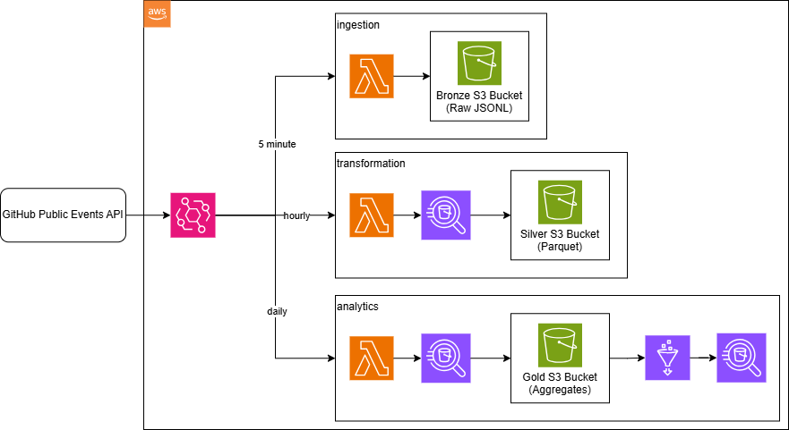

# terraform-aws-lakehouse

> **Terraform-first AWS Data Lakehouse**: real GitHub events -> Bronze/Silver/Gold on S3 -> Athena analytics, with CI/CD, security, and cost-optimized architecture. Built for learning.

## TL;DR

- Design and implement a production-grade data platform on AWS.
- Use Terraform modules, remote state, and multi-env patterns (dev/stage/prod).
- Apply security best practices: KMS, TLS-only buckets, IAM least privilege, OIDC (no long-lived keys).
- Care about costs: Lambda + Athena + partition projection instead of Kinesis/Glue crawlers.
- Integrate DevOps practices: Makefile workflows, CI validation, drift detection, runbooks, ADRs.

## Why this project is interesting for you

| Feature               | Implementation                                 | Value                                                              |
| --------------------- | ---------------------------------------------- | ------------------------------------------------------------------ |
| **Cost-Optimized**    | ~\$25/month for 3 environments                 | Cloud economics: Lambda instead of Kinesis saves ~87% (\$312/year) |
| **Security-First**    | OIDC, KMS, TLS-only buckets, drift detection   | Production-style posture, no long-lived AWS keys                   |
| **DevOps Excellence** | Makefile automation, pre-commit, CI validation | Reduces manual errors and config drift                             |
| **Data Architecture** | Medallion pattern (Bronze/Silver/Gold)         | Industry-standard lakehouse design                                 |
| **Fully Automated**   | Terraform modules + GitHub Actions             | Reproducible, zero-click deployments                               |

---

## Architecture at a Glance



**Key Design Decisions:**

- **Lambda -> S3**: Free tier eligible, fits GitHub API rate limits
- **Athena INSERT INTO**: Serverless, pay-per-query, simpler to maintain
- **Partition Projection**: Eliminates $0.44/DPU-hour crawler cost
- **Shared KMS Key**: One key per environment reduces cost from $3/mo to $1/mo

See [docs/architecture.md](docs/architecture.md) for detailed design and [docs/decisions.md](docs/decisions.md) for trade-off analysis.

---

## Skills Demonstrated

This project showcases production-ready expertise across multiple domains:

### Infrastructure as Code

- **Terraform Modules:** Reusable, DRY components (data_lake, catalog_athena, observability)
- **Remote State Management:** S3 backend with DynamoDB locking
- **Multi-Environment:** Dev/Stage/Prod from single codebase

### Cloud Architecture (AWS)

- **Serverless Design:** Lambda, Athena, EventBridge (no EC2/containers to manage)
- **Data Lake Pattern:** Medallion architecture (Bronze/Silver/Gold)
- **Cost Optimization:** Strategic service selection ($25/mo vs industry standard $300+/mo)

### Security & Compliance

- **Encryption Everywhere:** KMS for S3, TLS-only bucket policies
- **Zero Long-Lived Credentials:** GitHub OIDC for CI/CD
- **Least Privilege IAM:** Service-specific policies, no wildcards
- **Audit Trail:** S3 access logs, CloudWatch logs, drift detection

### DevOps & SRE

- **CI/CD Pipeline:** GitHub Actions with OIDC authentication
- **Automated Validation:** TFLint, Trivy, Checkov security scans
- **Drift Detection:** Nightly checks catch manual changes automatically
- **Observability:** CloudWatch alarms, SNS alerts, custom metrics

### Software Engineering

- **Modular Design:** Makefile structure, Python Lambda handlers
- **Error Handling:** Retries with exponential backoff, graceful failures
- **Code Quality:** Pre-commit hooks, linting, type hints

---

## What You'll Learn

**Terraform Patterns:**

- How to structure large Terraform projects (global/ -> modules/ -> envs/)
- Using data sources for dynamic IAM policies
- Partition projection on Bronze to eliminate Glue Crawlers
- Managing multiple environments without duplication

**AWS Architecture:**

- When to use Lambda vs Kinesis vs Glue for data ingestion
- How Athena INSERT-based transforms work (serverless ETL)
- Why Parquet format reduces query costs by 80%
- Cost/performance trade-offs in lakehouse design

**DevOps Best Practices:**

- OIDC for CI/CD (modern alternative to access keys)
- Drift detection patterns (catch unauthorized changes)
- Pre-commit hooks for quality gates
- Makefile automation for operational consistency

**Data Engineering:**

- Medallion architecture (why 3 layers?)
- Partitioning strategies (when to use date vs year/month)
- Schema evolution in data lakes
- Query optimization with Parquet + partitions

## Core Features

### Medallion Data Lake Architecture

Three-tier data pipeline with progressive transformation:

| Layer      | Format       | Partitioning           | Purpose               | Query Use Case          |
| ---------- | ------------ | ---------------------- | --------------------- | ----------------------- |
| **Bronze** | JSONL (gzip) | `ingest_dt=YYYY-MM-DD` | Raw, immutable events | Debugging, reprocessing |
| **Silver** | Parquet      | `year=YYYY/month=MM`   | Cleaned, typed data   | Analytics, ML features  |
| **Gold**   | Parquet      | `ingest_dt=YYYY-MM-DD` | Pre-aggregated KPIs   | Dashboards, reports     |

**Why this pattern?** Separates concerns: Bronze preserves raw truth, Silver enables analysis, Gold optimizes for consumption.

### Production-Grade Security

```
┌─────────────────────────────────────────────┐
│ Security Layer 1: Identity & Access         │
│ • OIDC (no long-lived AWS keys)             │
│ • Least-privilege IAM policies              │
│ • Public access blocked on all S3 buckets   │
└─────────────────────────────────────────────┘
         ↓
┌────────────────────────────────────────────────┐
│ Security Layer 2: Encryption                   │
│ • KMS CMK with annual rotation                 │
│ • TLS-only bucket policy (aws:SecureTransport) │
│ • Athena results encrypted                     │
└────────────────────────────────────────────────┘
         ↓
┌─────────────────────────────────────────────┐
│ Security Layer 3: Audit & Recovery          │
│ • S3 versioning (730-day retention)         │
│ • Centralized access logs                   │
│ • Drift detection (catches manual changes)  │
└─────────────────────────────────────────────┘
```

### Automated Operations

**CI/CD Pipeline:**

- Pre-commit hooks (format, lint, security scan)
- PR validation (Terraform plan + cost estimate)
- OIDC authentication (no credentials in GitHub)
- Nightly drift detection (auto-opens GitHub issues)

**Makefile Automation:**

- `make plan-dev` — Plan with validation
- `make apply-dev` — Apply with post-deployment checks
- `make check-dev` — Full validation suite (format, lint, security)
- `make destroy-dev` — Safe teardown with confirmation

### Cost-Conscious Design

| Component  | Choice               | Monthly Cost | Alternative      | Savings           |
| ---------- | -------------------- | ------------ | ---------------- | ----------------- |
| Ingestion  | Lambda (5 min)       | $2           | Kinesis Firehose | **87%** ($26/mo)  |
| Transform  | Athena INSERT INTO   | $0.01/query  | Glue Jobs        | **95%** ($20/mo)  |
| Metadata   | Partition Projection | $0           | Glue Crawler     | **100%** ($13/mo) |
| Encryption | 1 shared KMS key     | $1           | 3 separate keys  | **67%** ($3/mo)   |

**Total: ~$25/month for 3 full environments** (dev/stage/prod)

---

## Quick Start

### Prerequisites

- **Required:** Terraform >= 1.8.0, AWS CLI configured, AWS account
- **Optional:** Python 3.8+, pre-commit, TFLint, Trivy, Checkov (for development)

### 1- Bootstrap Infrastructure (One-Time)

```bash
# Clone the repository
git clone https://github.com/wadie-ejjoufari/terraform-aws-lakehouse
cd terraform-aws-lakehouse

# Bootstrap remote state (S3 + DynamoDB)
make init-remote-state
# Edit global/remote-state/terraform.tfvars with your AWS account ID
cd global/remote-state && terraform apply
```

### 2- Deploy Dev Environment

```bash
# Update backend configuration with your account ID
vim envs/dev/backend.hcl  # Replace <ACCOUNT_ID>

# Initialize and deploy
make init-dev
make plan-dev     # Review changes
make apply-dev    # Deploy infrastructure
```

**What gets deployed:**

- 4 S3 buckets (raw/silver/gold/logs) with KMS encryption
- 1 Lambda for GitHub event ingestion (runs every 5 min)
- 2 Lambda schedulers for Silver/Gold transforms
- Glue Catalog with 3 tables (Bronze/Silver/Gold)
- Athena workgroup for SQL queries
- CloudWatch alarms + SNS topics

### 3- Verify Deployment

```bash
cd envs/dev

# View outputs
terraform output

# Check if Lambda is running
aws lambda get-function --function-name dp-dev-github-events-ingestor

# Check if data is landing in Bronze
RAW_BUCKET=$(terraform output -json data_lake_buckets | jq -r '.raw')
aws s3 ls s3://$RAW_BUCKET/github/events/
```

### 4- Query Your Data

**Wait ~30 minutes** for data to flow through all layers, then:

```sql
-- Top GitHub event types (today)
SELECT event_type, SUM(events_count) AS total
FROM github_events_gold_daily
WHERE ingest_dt = CURRENT_DATE
GROUP BY event_type
ORDER BY total DESC
LIMIT 10;
```

Run via Athena console or:

```bash
aws athena start-query-execution \
  --query-string "SELECT * FROM github_events_bronze LIMIT 10" \
  --query-execution-context Database=dp-dev-lake \
  --work-group dp-dev-wg
```

### 5- Optional: Setup CI/CD

```bash
cd global/iam_gh_oidc
cp terraform.tfvars.example terraform.tfvars
# Edit with your GitHub org/repo
terraform apply
# Add output role ARN to GitHub secrets as AWS_OIDC_ROLE_ARN
```

---

## CI/CD & Automation

### GitHub Actions Workflows

**1. Plan & Validate** (`.github/workflows/plan-validate.yml`)

- Triggers on: Pull requests
- Actions: Format check -> Lint -> Security scan -> Terraform plan -> Cost estimate
- Auth: OIDC (no long-lived credentials)
- Output: PR comment with plan summary + cost impact

**2. Drift Detection** (`.github/workflows/drift-detection.yml`)

- Triggers on: Nightly schedule (02:27 UTC) + manual
- Actions: `terraform plan -detailed-exitcode` on all environments in parallel
- Output: GitHub issue if drift detected (labeled `drift` + `infra`)
- Why: Catches manual changes made outside Terraform

### Local Development

```bash
# Install pre-commit hooks (one-time)
pre-commit install

# Validate before committing
make check-dev    # Format, lint, security scan, Terraform validate

# Cost estimation
make cost-dev     # Shows monthly cost impact of changes
```

### Makefile Commands

| Command            | Purpose                         |
| ------------------ | ------------------------------- |
| `make help`        | Show all available commands     |
| `make init-dev`    | Initialize dev environment      |
| `make plan-dev`    | Plan changes with validation    |
| `make apply-dev`   | Apply + post-deployment checks  |
| `make check-dev`   | Full validation suite           |
| `make destroy-dev` | Safe teardown with confirmation |

See [Runbook](docs/runbook.md) for complete operational procedures.

## Example Queries & Results

### Top 10 Most Active Repositories (Today)

```sql
SELECT repo_name, SUM(events_count) AS activity
FROM github_events_gold_daily
WHERE ingest_dt = CURRENT_DATE
GROUP BY repo_name
ORDER BY activity DESC
LIMIT 10;
```

**Output Example:**

```
repo_name                    | activity
-----------------------------|----------
microsoft/vscode             | 1,247
kubernetes/kubernetes        | 892
tensorflow/tensorflow        | 634
```

### Event Type Distribution (Last 7 Days)

```sql
SELECT ingest_dt, event_type, SUM(events_count) AS total
FROM github_events_gold_daily
WHERE ingest_dt >= CURRENT_DATE - INTERVAL '7' DAY
GROUP BY ingest_dt, event_type
ORDER BY ingest_dt DESC, total DESC;
```

This data can power:

- **Dashboards**: GitHub activity trends over time
- **ML Models**: Predict popular repos, detect anomalies
- **BI Tools**: Integrate with Tableau, Looker, Power BI

---

## Development Setup

**Required Tools:**

- Terraform >= 1.8.0
- AWS CLI configured
- Python 3.8+ (for Lambda code)

**Optional:**

- pre-commit (quality gates)
- TFLint (Terraform linting)
- Trivy (security scanning)
- Checkov (policy validation)
- Infracost (cost estimation)

**Quick Setup:**

```bash
# Install pre-commit hooks
pre-commit install

# Validate everything
make check-all

# View estimated costs
make cost-dev
```

See [Development Guide](docs/runbook.md#development-setup) for detailed instructions.

---

## Project Structure

```
terraform-aws-lakehouse/
├── global/                    # Shared infrastructure
│   ├── remote-state/         # S3 backend + DynamoDB locking
│   └── iam_gh_oidc/          # GitHub OIDC for CI/CD
├── modules/                   # Reusable Terraform modules
│   ├── data_lake/            # S3 buckets (Bronze/Silver/Gold)
│   ├── catalog_athena/       # Glue Catalog + Athena
│   ├── athena_scheduler/     # Lambda for scheduled transforms
│   ├── github_events_lambda/ # Ingestion Lambda
│   └── observability/        # Logs, alarms, budgets
├── envs/                      # Per-environment configs
│   ├── dev/                  # Development
│   ├── stage/                # Staging
│   └── prod/                 # Production
├── docs/                      # Documentation
│   ├── architecture.md       # System design
│   ├── decisions.md          # ADRs
│   └── runbook.md            # Operations guide
└── Makefile*                  # Automation (6 modules)
```

---

## Cost Breakdown

| Environment | KMS | S3 (100GB) | Lambda | Athena | Total/mo       |
| ----------- | --- | ---------- | ------ | ------ | -------------- |
| Dev         | $1  | $6.90      | $0.50  | $0.10  | **~$8.50**     |
| Stage       | $1  | $6.90      | $0.50  | $0.10  | **~$8.50**     |
| Prod        | $1  | $6.90      | $0.50  | $0.10  | **~$8.50**     |
| **Total**   |     |            |        |        | **~$25.50/mo** |

**Why so cheap?**

- Free tier eligible (Lambda, Athena)
- Serverless (no idle EC2/RDS)
- Strategic service selection (Lambda vs Kinesis)
- Shared resources (1 KMS key per env)

Compare to traditional data warehouse: $300-500/month minimum.

---

## Documentation

| Document                             | Purpose                                 |
| ------------------------------------ | --------------------------------------- |
| [Architecture](docs/architecture.md) | System design, components, data flow    |
| [Decisions](docs/decisions.md)       | ADRs explaining "why" for each choice   |
| [Runbook](docs/runbook.md)           | Deployment, validation, troubleshooting |
| [Datasets](docs/datasets.md)         | Schema details, example queries         |

---
