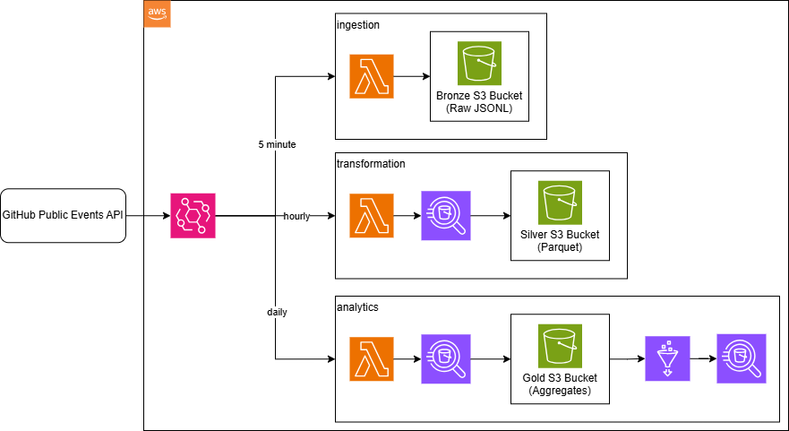

# terraform-aws-lakehouse

**A production-style AWS data platform, entirely in Terraform** — real-time ingestion, a
Bronze/Silver/Gold data lake, and SQL analytics via Athena, with the security and
governance controls a client would normally have to ask for separately, built in from
the start.

[](https://github.com/wadie-ejjoufari/terraform-aws-lakehouse/actions/workflows/plan-validate.yml)
[](https://github.com/wadie-ejjoufari/terraform-aws-lakehouse/actions/workflows/drift-detection.yml)

---

## The problem

Teams spin up cloud infrastructure fast, then fail their first security review: public
buckets, permissive access, no encryption at rest, no audit trail, no way to tell if
someone made a manual change outside of code. Getting infrastructure *working* and
getting it *defensible in a review* usually end up as two separate steps — and under
deadline pressure, the second one gets skipped.

## The approach

Every AWS resource here — storage, ingestion, the data catalog, query engine — is
defined declaratively in Terraform, and every non-default security decision is written
down as an [ADR](docs/decisions.md), not silently implemented: KMS encryption on every
bucket, TLS-only access enforced at the policy level, least-privilege IAM scoped per
function, OIDC authentication for CI instead of long-lived AWS keys, and a nightly job
that detects any change made outside of Terraform and opens a GitHub issue automatically.
Cost was treated as a real constraint, not an afterthought — see below.

## The result

Three full environments (dev / stage / prod) running on roughly **$25/month total**
against a realistic **$300–500/month** for the equivalent set up the "obvious" way
(Kinesis instead of scheduled Lambda, Glue Crawlers instead of declared schemas,
per-bucket KMS keys). Every pull request runs an automated security scan before merge —
badges above are live. Manual console changes get caught the same night they happen.

---

## Architecture



Alerts land in S3 in three tiers — raw JSONL (Bronze), typed Parquet (Silver), and
pre-aggregated daily analytics (Gold) — queried directly through Athena. Full breakdown,
including why each layer is partitioned the way it is, in
[docs/architecture.md](docs/architecture.md).

## Why it costs $25/month, not $300+

| Choice | Instead of | Saves |
|---|---|---|
| Lambda on a 5-minute schedule | Kinesis Firehose | ~87% (~$26/mo) |
| Athena `INSERT INTO` transforms | Glue Jobs | ~95% (~$20/mo) |
| Declared schemas + partition projection | Glue Crawlers | 100% (~$13/mo) |
| One shared KMS key per environment | A key per bucket | ~67% (~$3/mo) |

The reasoning behind each of these — including what was rejected and why — is in
[docs/decisions.md](docs/decisions.md). Most Terraform portfolio repos show the HCL;
this one also shows the thinking behind it.

---

## For technical reviewers

This README is deliberately short. The depth is in `docs/`:

- **[docs/architecture.md](docs/architecture.md)** — full system design, every component
- **[docs/decisions.md](docs/decisions.md)** — 11 ADRs: the decision, the rationale, the
  trade-off, and what was rejected instead
- **[docs/runbook.md](docs/runbook.md)** — deployment, validation, troubleshooting,
  rollback
- **[docs/datasets.md](docs/datasets.md)** — schema and example queries per layer

## Quick start

```bash
git clone https://github.com/wadie-ejjoufari/terraform-aws-lakehouse
cd terraform-aws-lakehouse
make init-remote-state          # one-time: S3 backend + DynamoDB locking
cd envs/dev && vim backend.hcl  # set your AWS account ID
make init-dev && make plan-dev  # review before applying
make apply-dev                  # deploys: S3 lake, ingestion Lambda, Athena, alarms
```

Full walkthrough, including CI/CD setup and how to query the data once it's flowing, in
[docs/runbook.md](docs/runbook.md).

## Stack

Terraform · AWS (S3, Lambda, Athena, Glue Catalog, EventBridge, KMS, CloudWatch) ·
GitHub Actions (OIDC, drift detection) · Python (Lambda handlers)

---

Building or hardening something similar on your own AWS account — happy to talk through
how this maps to your setup.
